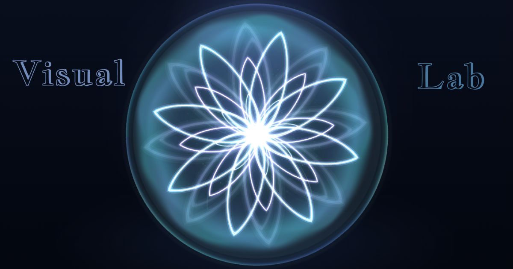

# Sphere Visual Lab

[](https://github.com/Alexandr-Dudarin/Sphere-Animation/actions/workflows/ci.yml)
[](https://www.npmjs.com/package/sphere-visual-lab)

[Живое демо](https://sphere-visual-lab.vercel.app/) · [npm-пакет](https://www.npmjs.com/package/sphere-visual-lab) · [Документация библиотеки](./sphere-visual-lab/README.md) · [MIT License](./LICENSE)



**Sphere Visual Lab** — переиспользуемая библиотека анимированных WebGL-визуалов для React, Three.js и React Three Fiber с отдельной интерактивной витриной.

Проект создавался не как один декоративный эффект, а как основа для подключения на сайты и в интерфейсы разных проектов. Визуальные компоненты отделены от demo-слоя, имеют публичный TypeScript API, собственную library-сборку и проверяются после установки в чистое React/Vite-приложение.


## Установка библиотеки

Для существующего React 19-проекта:

```bash
npm install sphere-visual-lab three @react-three/fiber @react-three/drei
```

Подключите стили пакета один раз в точке входа приложения:

```tsx
import 'sphere-visual-lab/style.css';
```

Минимальный пример:

```tsx
import { SphereVisual } from 'sphere-visual-lab';
import 'sphere-visual-lab/style.css';

export function Example() {
  return (
    <SphereVisual
      width="100%"
      height="100%"
      size={420}
      preset="glass-petal"
      background="transparent"
    />
  );
}
```

Пакет опубликован в npm как [`sphere-visual-lab`](https://www.npmjs.com/package/sphere-visual-lab). Подробные примеры, props и список пресетов находятся в [документации библиотеки](./sphere-visual-lab/README.md).

## Визуальные системы

### SphereVisual

Семейство стеклянных светящихся сфер с лепестковой структурой, внутренним объёмом, несколькими цветовыми пресетами и режимами анимации.

Поддерживает:

- Three.js- и облегчённый CSS-рендерер;
- реакцию на движение указателя;
- режимы `idle`, `thinking` и `searching`;
- настройку качества, свечения, скорости, размера и фона.

### OrbitalVisual

Семейство orbital / ring / ribbon-объектов:

- атомные системы;
- кольцевые планеты;
- механические ядра;
- энергетические порталы.

Каждое семейство имеет собственные пресеты, палитры и конфигурации сцены.

## Интерактивное демо

Живая витрина опубликована на Vercel:

**https://sphere-visual-lab.vercel.app/**

В демо можно:

- переключать визуальные семейства и пресеты;
- изменять размер объекта без перестройки внешней сцены;
- настраивать качество, интенсивность свечения и скорость;
- выбирать фон демонстрационной сцены;
- проверять адаптивность на ноутбуках, планшетах и телефонах;
- сохранять выбранные настройки после перезагрузки страницы.

Фоны `studio`, `space` и `tech` относятся только к витрине. Сами библиотечные компоненты могут использовать прозрачный фон и размещаться поверх дизайна родительского проекта.

## Ключевые инженерные решения

### Библиотека отделена от демо

`SphereVisual` и `OrbitalVisual` не зависят от панелей управления, карточек пресетов и demo-фонов. Публичная точка входа находится в `src/index.ts` и экспортирует компоненты, типы, каталоги и вспомогательные функции без внутреннего demo-кода.

### Отдельная library-сборка

Помимо production-сборки витрины проект формирует самостоятельный пакет:

```text
dist-lib/
  index.js
  index.js.map
  style.css
  types/
```

В пакет входят JavaScript, CSS и TypeScript-декларации. React, React DOM, Three.js, React Three Fiber и Drei подключаются как peer dependencies и не дублируются внутри library-бандла.

### Orbital вынесен в отдельный chunk демо

Orbital-рендереры загружаются отдельно от начального кода страницы. Sphere доступна сразу, а более тяжёлая orbital-часть подготавливается отдельно.

В текущей production-сборке:

```text
initial demo JS: около 1.15 MB / 314 kB gzip
Orbital chunk:   около 87 kB / 22.7 kB gzip
```

### Мини-карточки не создают отдельные WebGL-сцены

Карточки пресетов используют лёгкие CSS-превью, а не отдельный `Canvas` для каждого объекта. Полноценная Three.js-сцена работает только в основной области выбранного визуала. Это уменьшает нагрузку на CPU/GPU и не создаёт десятки параллельных WebGL-контекстов.

### WebGL-рендер приостанавливается вне viewport

Orbital Canvas заранее прогревается, но сцена вдали от viewport переводится из постоянного `frameloop="always"` в `frameloop="demand"`. При приближении пользователя анимация заранее возобновляется.

Сглаживание реакции Sphere на указатель также работает только во время фактического движения и прекращает обновления после достижения целевого положения.

### Размер объекта отделён от размера сцены

Контейнер preview-области остаётся стабильным, а `size` управляет внутренним масштабом визуала. Доступное пространство отслеживается через `ResizeObserver`, поэтому объект сохраняет центрирование и корректно адаптируется при изменении viewport.

### Пакет проверяется как внешний потребитель

Library-сборка упаковывается через `npm pack`, устанавливается во временный чистый React/Vite-проект и проходит TypeScript-проверку и production build только через публичные импорты:

```tsx
import { OrbitalVisual, SphereVisual } from 'sphere-visual-lab';
import 'sphere-visual-lab/style.css';
```

Так проверяется не только исходный репозиторий, но и реальный сценарий использования будущего npm-пакета.

## Что уже реализовано

- каталоги и пресеты Sphere и Orbital;
- публичный API и TypeScript-типы;
- управление размером, качеством, свечением, скоростью и фоном;
- адаптивная демонстрационная витрина;
- сохранение demo-настроек в `localStorage`;
- production- и library-сборки;
- отдельный Orbital chunk;
- пауза WebGL-рендера вне viewport;
- consumer package smoke test;
- 47 unit- и component-тестов;
- 10 Playwright E2E-сценариев;
- GitHub Actions CI после push и pull request;
- живое демо на Vercel;
- npm-метаданные и MIT License;
- версия `sphere-visual-lab@0.1.0` опубликована в npm.

## Стек

- React 19;
- TypeScript;
- Vite;
- Three.js;
- React Three Fiber;
- Drei;
- Vitest и Testing Library;
- Playwright;
- GitHub Actions;
- Vercel.

## Структура репозитория

```text
Sphere-Animation/
  .github/workflows/   # CI
  sphere-visual-lab/   # приложение, библиотека и подробная документация
  README.md            # обзор репозитория
  LICENSE
```

Основной проект:

```text
sphere-visual-lab/src/
  components/
    SphereVisual/
    OrbitalVisual/
  demo/
  shared/
  app/
  index.ts
```

- `components` — переиспользуемые визуальные компоненты;
- `demo` — витрина, панели управления, карточки и demo-фоны;
- `shared` — общие типы, UI-компоненты и утилиты;
- `src/index.ts` — публичная точка входа библиотеки.

## Локальный запуск

```bash
git clone https://github.com/Alexandr-Dudarin/Sphere-Animation.git
cd Sphere-Animation/sphere-visual-lab
npm install
npm run dev -- --host 127.0.0.1 --port 5173
```

Открыть:

```text
http://127.0.0.1:5173
```

## Проверки

```bash
npm test
npm run build
npm run build:lib
npm run check:all
npm run test:e2e
npm run consumer:smoke
npm run pack:dry-run
```

GitHub Actions автоматически запускает unit/component tests, обе сборки, Playwright E2E и consumer package smoke test после push и pull request в `main`.

## Использование библиотеки

Подробные инструкции, список props, пресетов, публичных типов и примеры интеграции находятся в:

**[`sphere-visual-lab/README.md`](./sphere-visual-lab/README.md)**

Пакет опубликован в npm под именем [`sphere-visual-lab`](https://www.npmjs.com/package/sphere-visual-lab). Текущая версия — `0.1.0`.

## Лицензия

Проект распространяется по лицензии [MIT](./LICENSE).
